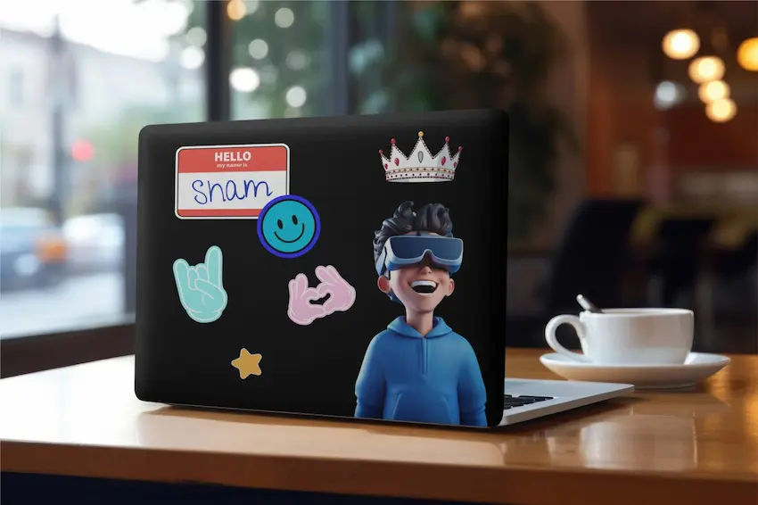

# Hi there 👋

<!--
**shamvoke/shamvoke**
-->
Welcome to the awesome world of  

I'm Sham, a passionate web developer based in Nairobi, constantly exploring the realms of code and creativity. 🚀

## About Me ✨

👨‍💻 With a fervent love for clean code and elegant designs, I dive headfirst into the world of web development, always seeking to push the boundaries of what's possible.

🎨 When I'm not crafting pixel-perfect websites or diving into the latest tech trends, you can find me exploring the vibrant streets of Nairobi, Immersing myself in the rich cultural tapestry that inspires my work.

🌱 I believe in the power of continuous learning and growth, constantly expanding my skill set to stay ahead in the ever-evolving tech landscape.

## My Tech Toolbox 🧰

⚡ **Languages:** HTML, CSS, JAVASCRIPT, ~~Python~~

💻 **Frameworks & Libraries:** Svelte, Node.js, ~~React.js~~, Next.js

🛠️ **Tools:** Git, VS Code, Docker, Linux (Arch KDE FTW!), Photoshop

## What I'm Currently Up To

🔭 Exploring the latest advancements in front-end development and diving deeper into the world of UI/UX design.

📚 Learning about serverless architecture and how it can revolutionize the way we build and deploy web applications.

🌐 Contributing to open-source projects and collaborating with like-minded developers to make a positive impact on the tech community.

🚀 Lead Designer at [Webmeka](https://www.webmeka.com/)   - A Digital Creative Agency

## Let's Connect! 🌍

📫 Want to collaborate on a project, 💬 discuss the latest tech trends, or just grab a cup of coffee (virtually, of course:)? Feel free to reach out via: 

🚀 Excited to embark on this coding journey together and create some truly amazing things! 😊
